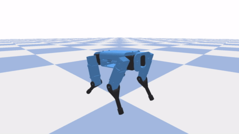
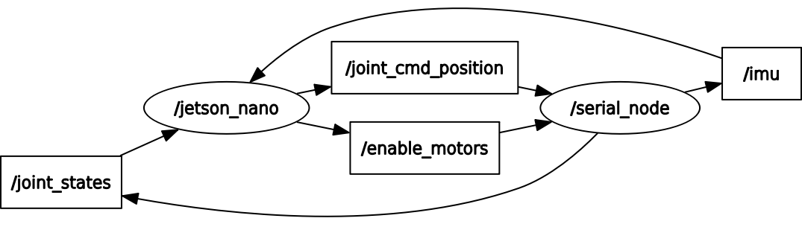

# Spot Micro Dynamixel Quadruped Robot

  

Key features:
* 12 DOF: 3 DOF per leg
* 340×205×270 mm (l×w×h)
* 2.3 kg
* Dynamixel motors
* ROS integrated 
* Realsense camera, IMU
* Computer: Jetson nano with GPU
* Microcontroller: OpenCR 
* 3D printed

## Lateral Fall Recovery

  

## Supine Fall Recovery

  

## PyBullet Simulation

  

## ROS Integrated

  

